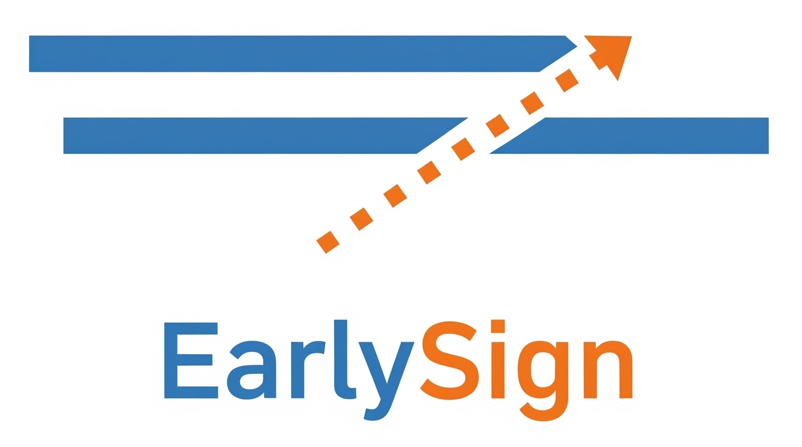

# EarlySign

<center>
<br/>
Early signs, faster decisions.
</center>

## What is this?

EarlySign is a Python library for sequential/safe testing (alpha-spending, e-processes, etc.).

1. Group sequential tests for interim analysis
    - By using alpha-spending functions to control the overall Type I error rate, you can stop early for efficacy or futility, making your experiments more efficient without compromising statistical integrity. This approach allows for a pre-specified number of interim analyses during an experiment.
1. e-processes for anytime-valid inference
    - It allows you to continuously monitor your experiments and make decisions as soon as the evidence is strong enough, without waiting for a predetermined sample size. This can lead to faster conclusions, saving time and resources, while maintaining statistical rigor.

## Install

```
pip install earlysign
```

## Usage

This library supports the following steps in your experimentation.

1. Planning / Designing
1. Executing / Analyzing
1. Reporting / Visualizing
1. (optionally) Educating

### Overview

```python
from earlysign import designs

##################
# Planning phase #
##################
# A) assisted planning
design = designs.GroupSequential.from_power_analysis(
    mde=0.01,
    power=0.8,
    alpha=0.05,
    outcome_type="binary",
    num_interims=4 # analyze 4 times
)

# B) or... manually specify your experimental design
design = designs.GroupSequential(
    name="example-run", variants=["A", "B"],
    outcome_type="binary",
    alpha_spending_fn="obrien-fleming",
    max_batches=1000,
    alpha=0.05,
    efficacy=True, futility=False
)

###################
# Execution phase #
###################
# 1) execute the experiment in object-oriented style
from earlysign import Experiment
experiment = Experiment(design)  # stateful experiment object
experiment.initialize()          # init state
experiment.update(observation_1) # first batch of data
experiment.update(observation_2) # second batch of data
experiment.conclude()            # form the best advice with the current state
report = experiment.report()     # generate a report

# 2) or in functional style if you prefer
from earlysign import handlers
handler = handlers.get_handler(design)        # design-specific handler
state = handler.initial_state()              # {} -> State
state = handler.update(state, observation_1) # (Design, State, Obs) -> State
state = handler.update(state, observation_2) # (Design, State, Obs) -> State
conclusion = handler.conclude(state)         # (State) -> Conclusion
report = handlers.get_reporter(design).report(conclusion) # Conclusion -> Report
```

Internally, the object-oriented API is a wrapper around the functional-programming API.

### Documentation
For detailed usage and available methods, see the [docs](docs/).

You can also find useful tutorial [here](docs/tutorials).
